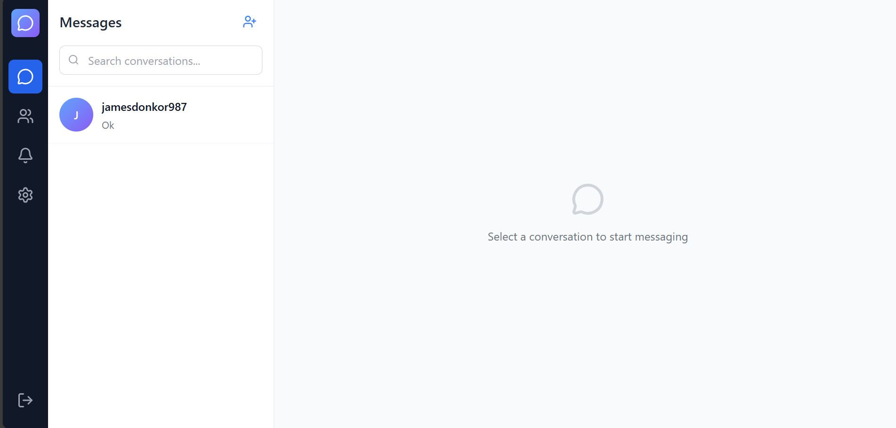
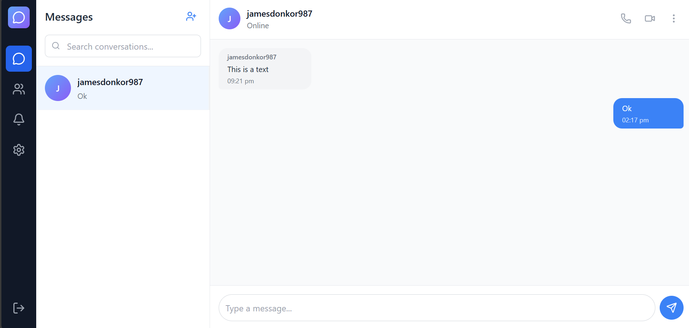
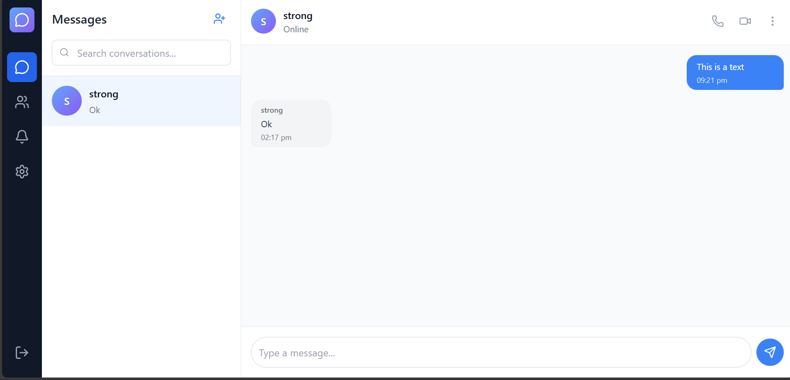
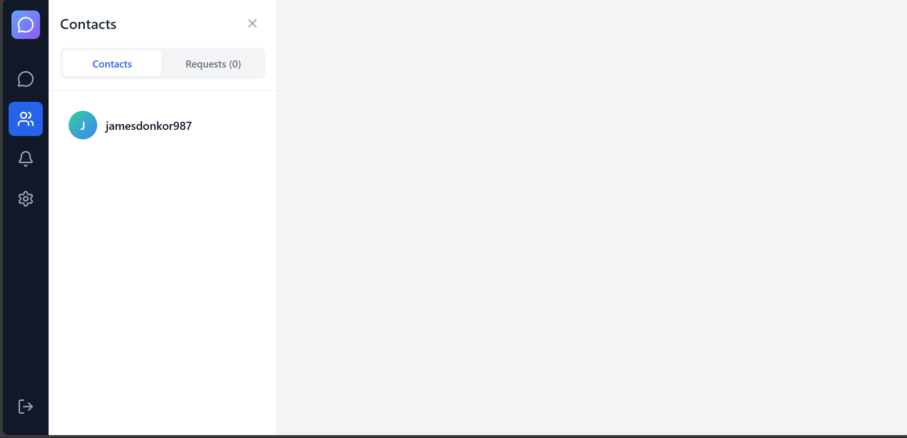

# ChatApp

A modern, full-stack chat application with authentication, real-time messaging, and user management.

---

## Table of Contents

- [Features](#features)
- [Screenshots](#application-screenshots)
- [Installation](#installation)
- [Usage](#usage)
- [API Endpoints](#api-endpoints)
- [WebSocket Endpoints](#websocket-endpoints)
- [Technologies Used](#technologies-used)
- [Contributing](#contributing)
- [License](#license)

---

## Features

- User registration, login, and JWT authentication
- Email verification and password reset
- Two-factor authentication (2FA)
- Real-time chat with WebSockets
- Private and group chats
- Contact management
- Responsive UI

---

## Application Screenshots

Below are some screenshots of the application in action:

### Login Screens


### Chat Screens





### Contacts Screen



---

## Installation

1. **Clone the repository:**
   ```bash
   git clone https://github.com/donkor-james/chatapp.git
   cd chatapp
   ```
2. **Backend setup:**

   - Create a virtual environment and activate it.
   - Install dependencies:
     ```bash
     pip install -r requirements.txt
     ```
   - Run migrations:
     ```bash
     python manage.py migrate
     ```
   - Start the backend server (with Daphne for WebSocket support):
     ```bash
     daphne chat_backend.asgi:application
     ```

3. **Frontend setup:**
   - Navigate to the frontend dir:
     ```bash
     cd chatapp_frontend
     ```
   - Install dependencies:
     ```bash
     npm install
     ```
   - Start the frontend server:
     ```bash
     npm start
     ```

---

## Usage

- Register a new account or log in with existing credentials.
- Verify your email address if required.
- Start a new chat or join an existing one.
- Send and receive messages in real time.
- Manage your contacts and profile settings.

---

## API Endpoints

- `/api/auth/register/` - Register a new user
- `/api/auth/login/` - Login and obtain JWT tokens
- `/api/auth/2fa/verify/` - Verify 2FA code
- `/api/chats/` - List or create chats
- `/api/chats/<chat_id>/messages/` - List or send messages in a chat
- `/api/users/me/` - Retrieve or update user profile

---

## WebSocket Endpoints

- `ws://localhost:8000/ws/notifications/` — Real-time notifications (e.g., unread count)
- `ws://localhost:8000/ws/chat/<chat_id>/` — Real-time chat messages for a specific chat

**Usage:**

- Connect to these endpoints using a WebSocket client in your frontend.
- Authentication is typically handled by passing a JWT token in the connection query or headers.

---

## Technologies Used

- **Backend:** Django, Django REST Framework, SimpleJWT, Channels, Daphne
- **Frontend:** React, Tailwind CSS
- **WebSockets:** Django Channels
- **Database:** SQLite (default), can be changed

---

## Contributing

Pull requests are welcome! For major changes, please open an issue first to discuss what you would like to change.

---

## License

This project is licensed under the MIT License.
